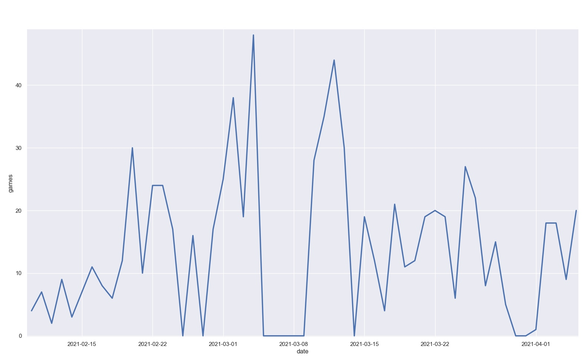
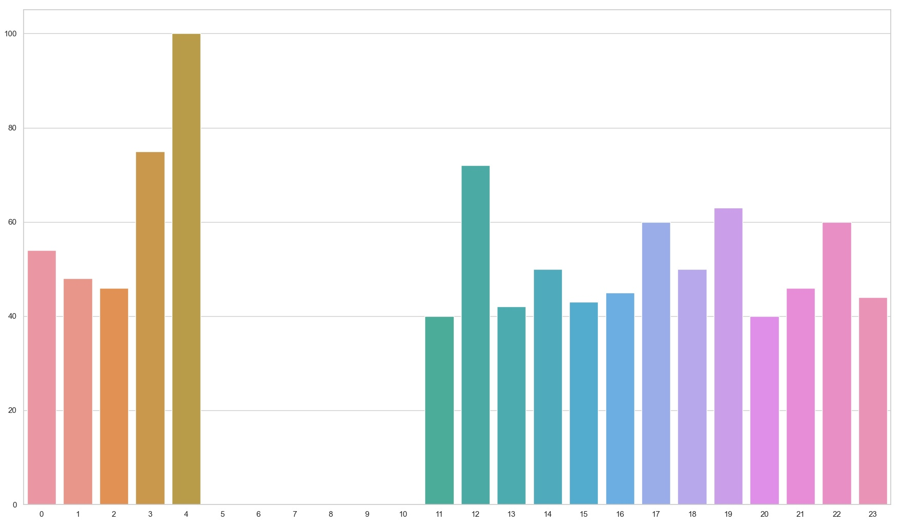
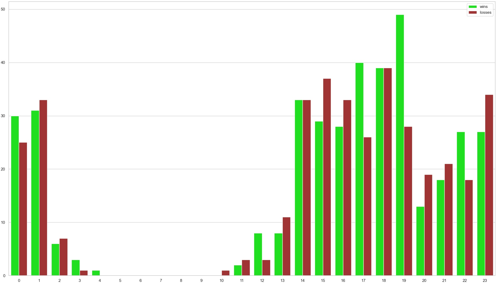
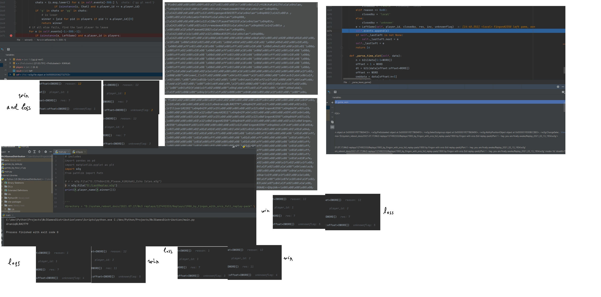

# Wc3GamesDistribution
This repo consists of a set of tiny scripts for Warcraft 3 game history visualization. The supported graphs include:
- [games by date](core/games_by_date.py) 
- [games by hour](core/games_by_hour_v1.py)
- [winrate by hour](core/winrate_by_hour.py)
- [win/loss by hour](core/win_loss_by_hour.py)

# Screenshots
#### Games by date

#### Winrate by hour

#### Win-loss by hour

# w3g py lib & optimizations
The underlying library used for replay parsing was the [*w3g lib*](https://pypi.org/project/w3g/) by [*Anthony Scopatz*](https://pypi.org/user/scopatz/).  
This is one of the very few w3g python libraries out there and it's written in a very clean and simple manner.  

However, at the point of creation of this project the library had been abandoned by its maintainer and ***it was crashing*** on newer replays.  
I did rewrite the engine so it could handle the latest version of replays.  

***The second issue was the perfomance***: as clean as the code has been, the library was literally unsuitable for use on large samples of data, - each replay file could take up to 3-5 seconds to parse.  

As the internal parsing engine have been slightly optimised, the whole pack of ***~900 replays*** took just about 4.5 seconds to get parsed in total.  

Which means we got close to **(10^3)x** running time speedup on a **~10^3** items sample with just a handful of simple optimizations in a totally unknown codebase in a couple of hours. Oh, and by the way, it was my first time to work with Python.

  
Optimization process

  

